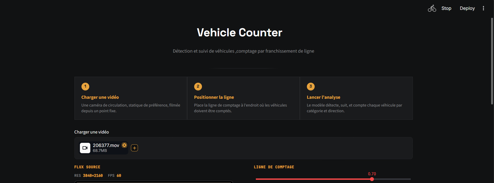
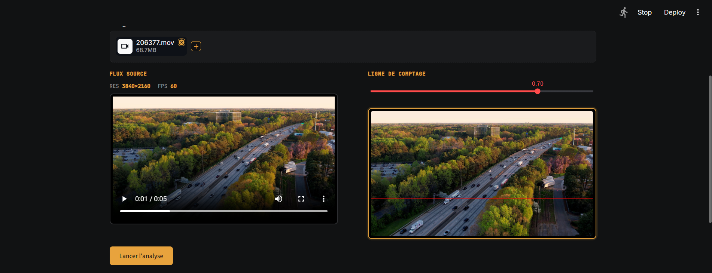
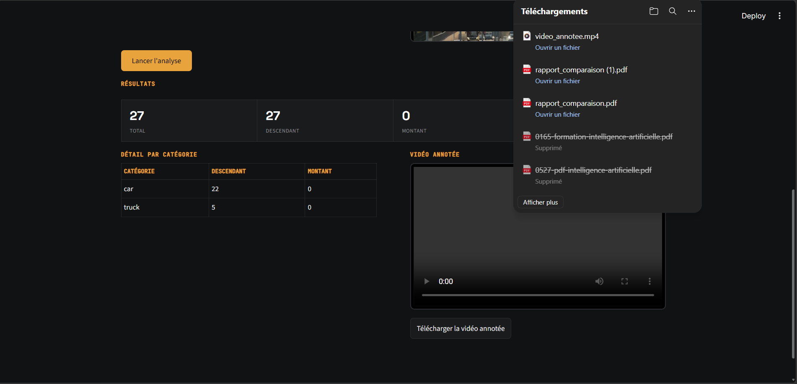
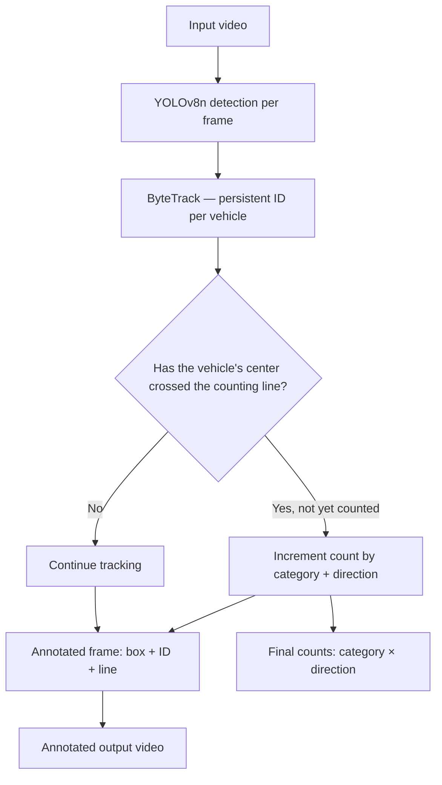

# Vehicle Counter : Computer Vision






A computer vision application that detects, tracks, and counts vehicles in traffic footage. Each vehicle is tracked across frames (not just detected frame-by-frame) and counted once it crosses a configurable virtual line, broken down by category (car, truck, bus, motorcycle) and direction of travel.

## Features

- **Object detection**: YOLOv8n identifies vehicles in each video frame
- **Multi-object tracking**: ByteTrack assigns a persistent ID to each vehicle across frames, so it is never counted twice
- **Directional line-crossing counting**: a configurable virtual line splits counts into two directions (e.g. northbound/southbound), not just a raw total
- **Interactive line positioning**: preview the exact frame where the counting line will sit before running the full analysis
- **Annotated video output**: the processed video shows bounding boxes, tracking IDs, and the counting line, playable directly in the interface
- **Per-category breakdown**: results are split by vehicle type, not just a single aggregate number

## Why this matters

Manual traffic counting (a person with a clicker counter on the roadside) is still common in many cities. This project demonstrates how a single fixed camera and a lightweight, pre-trained model can replace that manual process generating directional, per-category counts automatically, with no custom training required. The same pipeline generalizes to parking occupancy, pedestrian counting, or retail footfall analysis by swapping the tracked object classes.

## Tech stack

| Component         | Technology              |
|--------------------|---------------------------|
| Object detection    | YOLOv8n (Ultralytics)     |
| Multi-object tracking | ByteTrack (via Ultralytics `track()`) |
| Video processing     | OpenCV                   |
| Interface            | Streamlit                |

## Architecture



## Getting started

### Prerequisites

- Python 3.11+

### Installation

```bash
git clone https://github.com/youmbidan/object-counter-vision.git
cd object-counter-vision

python -m venv venv
venv\Scripts\activate        # Windows
# source venv/bin/activate   # macOS/Linux

python -m pip install -r requirements.txt
```

No API key is required , YOLOv8n is a pre-trained model that downloads automatically on first run.

### Run the app

```bash
streamlit run app.py
```

Upload a traffic video (ideally filmed from a fixed, elevated angle), position the counting line using the live preview, and run the analysis.

## Known limitations

- Vehicle classes are limited to the four COCO categories relevant to road traffic: car, motorcycle, bus, truck
- Counting accuracy depends on camera angle a near-overhead or elevated angle works significantly better than eye-level footage, where vehicles overlap visually
- Processing is done frame-by-frame on CPU by default; longer videos take proportionally longer to process
- The counting line only detects a single straight horizontal crossing; curved roads or multiple lanes crossing at different angles are not handled

## Possible improvements

- Adjustable line angle (not just horizontal position)
- Multi-line counting for intersections
- Real-time processing from a live camera stream instead of an uploaded file
- Speed estimation between two counting lines

---

## À propos (FR)

Cette application de vision par ordinateur détecte, suit et compte les véhicules dans une vidéo de circulation. Chaque véhicule est suivi d'une image à l'autre (pas seulement détecté isolément) et compté une seule fois lorsqu'il franchit une ligne virtuelle configurable, avec un détail par catégorie de véhicule et par direction. Ce projet a été développé dans le cadre de la constitution d'un portfolio technique pour une recherche de stage de fin d'études en intelligence artificielle.